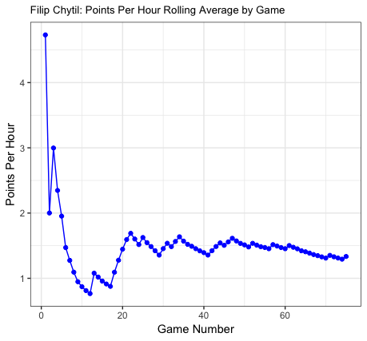

# Rangers-Rookie-Wall

The code I used to analyze the scoring of Rangers Rookies.

#Motivation

I was interested to see if any Rangers Rookies hit what is commonly refered to as the "rookie wall". The "rookie wall" is a common phrase in Hockey for when rookies in the NHL start to struggle in the middle or towards the end of the NHL regular season because they are not used to the length and difficulty of the season.

